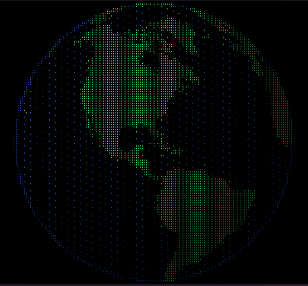

# earth

A rotating Earth in your terminal, drawn with Unicode Braille dots. Think `cmatrix`, but a planet.



- One file, no dependencies: needs only Python 3.
- Real coastlines from [Natural Earth](https://www.naturalearthdata.com/) (1:50m), embedded in the script. Works offline.
- Round globe on any font: corrects for the terminal's cell shape.
- Flicker-free and light on CPU: only changed characters are redrawn.
- Adapts to window resizing, restores the terminal on exit.

## Install

Works on Linux and macOS (on Windows, use WSL). Run it straight away:

```sh
curl -fLO https://raw.githubusercontent.com/01th/earth/main/earth
python3 earth
```

Or install it as a command available everywhere:

```sh
sudo curl -fL https://raw.githubusercontent.com/01th/earth/main/earth -o /usr/local/bin/earth
sudo chmod +x /usr/local/bin/earth
earth
```

Without sudo, use `~/.local/bin/earth` instead (that folder must be in your `PATH`).

To uninstall, delete the file: `sudo rm /usr/local/bin/earth`.

## Usage

```
earth [-s SPEED] [-f FPS] [-z SIZE] [--start LON] [--bg R,G,B]
```

| option | meaning | default |
|---|---|---|
| `-s, --speed` | rotation speed, degrees per second (negative reverses) | 12 |
| `-f, --fps` | frames per second | 30 |
| `-z, --size` | globe size as a fraction of the window (0.2–1) | 1.0 |
| `--start` | longitude facing you at start | 15 |
| `--bg` | background colour around the globe, e.g. `0,0,0` for black | `14,22,16` (dark green) |
| `-V, --version` | print version | |

Keys: `q` / `Esc` / `Ctrl+C` quit, `space` pause, `+` / `-` change speed.

## Requirements

- Python 3.8+
- A terminal with 24-bit color: kitty, Alacritty, WezTerm, foot, GNOME Terminal, Konsole, iTerm2, Windows Terminal, Termux and others.
- A font with Braille characters (U+2800–U+28FF). Most modern fonts have them.

The bare Linux text console (TTY) is not supported: it has no Braille glyphs or true color.

Tip: a smaller font gives a more detailed globe, e.g. `kitty -o font_size=8 earth`.

## License

MIT, see [LICENSE](LICENSE). Map data: Natural Earth, public domain.
